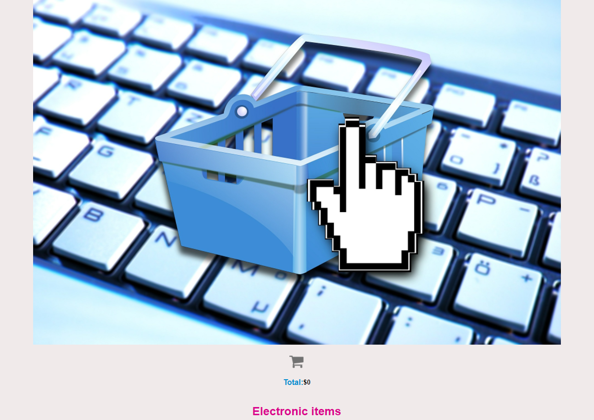
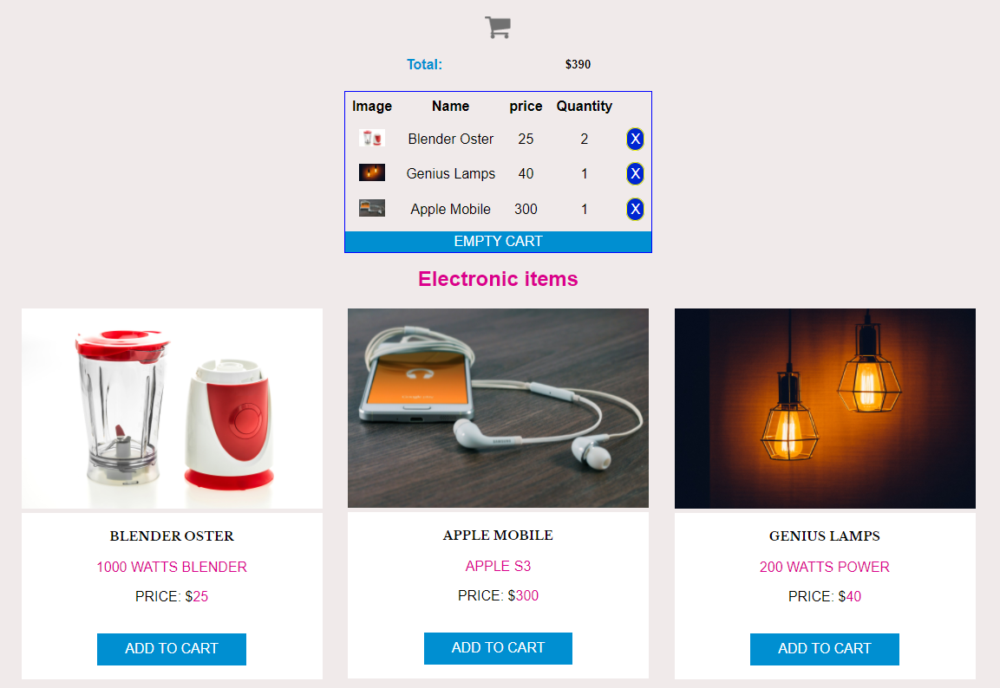

# Shopping-Cart-JavaScript :tent: :tw-2705:

-   Idea for a shopping cart in javascript

-   _Shopping cart example using HTML, CSS and JavaScript_.

---

Shopping cart example using html, css and javascript. This adds the items and calculates their price, even if items are removed.

[ShoppingCart-Web](https://simplecartshopping.netlify.app/ 'ShoppingCart-Web')

[ShoppingCart-Web](https://simplecartshopping.netlify.app/ 'ShoppingCart-Web')
